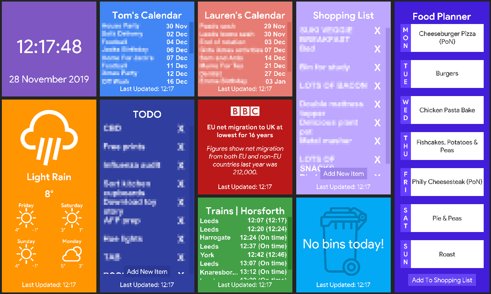

[![Made with Unity](https://img.shields.io/badge/Made%20with-Unity-57b9d3.svg?style=flat-square&logo=data%3Aimage%2Fpng%3Bbase64%2CiVBORw0KGgoAAAANSUhEUgAAAA4AAAAOCAMAAAAolt3jAAABklBMVEUIJCYRLjARLzEWICcbIyYcLDQdJS4dKjMdLTQeKTMeKTUeKjMeKzMeKzQeNDceNTkeNzkeODkfIy8fJi8fJjAfMDQgJzEgKDIgKTIgMTUgMjkhJjAhKDMhKTIhKTQhKzYhLDYhLDchLjUhLjYiKTAiLDciLTgjKjIjLTcjLjkkLTgnKDYnKTYnLjb%2F%2F%2F%2F%2F%2F%2F%2F%2F%2F%2F%2F%2F%2F%2F%2F%2F%2F%2F%2F%2F%2F%2F%2F%2F%2F%2F%2F%2F%2F%2F%2F%2F%2F%2F%2F%2F%2F%2F%2F%2F%2F%2F%2F%2F%2F%2F%2F%2F%2F%2F%2F%2F%2F%2F%2F%2F%2F%2F%2F%2F%2F%2F%2F%2F%2F%2F%2F%2F%2F%2F%2F%2F%2F%2F%2F%2F%2F%2F%2F%2F%2F%2F%2F%2F%2F%2F%2F%2F%2F%2F%2F%2F%2F%2F%2F%2F%2F%2F%2F%2F%2F%2F%2F%2F%2F%2F%2F%2F%2F%2F%2F%2F%2F%2F%2F%2F%2F%2F%2F%2F%2F%2F%2F%2F%2F%2F%2F%2F%2F%2F%2F%2F%2F%2F%2F%2F%2F%2F%2F%2F%2F%2F%2F%2F%2F%2F%2F%2F%2F%2F%2F%2F%2F%2F%2F%2F%2F%2F%2F%2F%2F%2F%2F%2F%2F%2F%2F%2F%2F%2F%2F%2F%2F%2F%2F%2F%2F%2F%2F%2F%2F%2F%2F%2F%2F%2F%2F%2F%2F%2F%2F%2F%2F%2F%2F%2F%2F%2F%2F%2F%2F%2F%2F%2F%2F%2F%2F%2F%2F%2F%2F%2F%2F%2F%2F%2F%2F%2F%2F%2F%2F%2F%2F%2F%2F%2F%2F%2F%2F%2F%2F%2F%2F%2F%2F%2F%2F%2F%2F%2F%2F%2F%2F%2F%2F%2F%2F%2F%2F%2F%2F%2F%2F%2F%2F%2F%2F%2F%2F%2F%2F%2F%2F%2F%2F%2F%2F%2F%2F%2F%2F%2F%2F%2F%2F%2F%2F%2F%2F%2F%2F%2F%2F%2F%2F%2F%2F%2F%2F%2F%2F%2F%2F%2F%2F%2F%2F%2F%2F%2F%2F%2F%2F%2F%2F%2F%2F%2F%2F%2F%2F%2F%2F%2F%2F%2F%2F%2F%2F%2F%2F%2F%2F%2F%2F%2F%2F%2F%2F%2F%2F%2F%2F%2F%2F%2F%2F%2F%2F%2F%2F%2F%2F%2F%2F%2F%2F%2F%2F%2F9oVHO%2FAAAAhXRSTlMAAAAAAAAAAAAAAAAAAAAAAAAAAAAAAAAAAAAAAAAAAAAAAAAAAAAAAAAAAAAAAQUGCAkMDhATFBcZGh0hIyYtNT1IS05RVFZXW1xeYWNnbG9wcXN2eHt9goaKkpWXo6usrbCztLW2ubq7vL2%2Bv8HDxsjKzNfY5OXn6%2Bzt8fP09vj5%2FP3%2BxDGH3QAAAMlJREFUeAFjUFTiZ5AWEFQ1dgwvDuIEc8WkHDJrW1tb07nBXHOb%2FPIYz7LWSgsgl8%2B9NclWjz24LrTVmUFR2b0110SE1aYhyqg%2BmkHRozXNkE2LI67KXDy7iMG7uTUnITU5s9WXhSfQi8GvtbUgMz%2BvsNVLSMbfjUHUpzVRX0VXPb7ClCujiEGSyac1xUhY1q4pwqAulkGSkdmnNd5KTiKsJqDVBcTVtLbPL410LW%2BptgRz5dUcixpbW1qzuMFcBW0dDTOnqJIQXgB6SzT11MCPiQAAAABJRU5ErkJggg%3D%3D)](https://unity3d.com)

# Home Dashboard

  

A dashboard with useful information to display in my house. The idea is to build a dashboard which then will be displayed 24/7 on a tablet stuck to the fridge via magnets.

Originally created using the [Smashing](https://github.com/Smashing/smashing) dashboard in Ruby, but moved to a [Unity3D](https://unity.com/) project as I was after some interactivity (such as adding and removing from a shopping list) instead of just displaying information (And also I could customize the widgets further than the Smashing dashboard).

I have also built a simple [microservice type react app](https://github.com/iamtomhewitt/home-dashboard-list-uploader) to keep an online list that can be accessed from iPhone shortcuts.

## Widgets
The current set of widgets on my dashboard are:

### Clock
A clock showing the date and time.

### Google Calendars
A scrollable widget showing mine and my partners calendar for the next three months. Any edits to calendar events are done through the Google Calendar app itself and not the dashboard.

### Online Lists
Scrollable list widgets - one for TODOs, and one for the shopping list. Both can be modified (add and remove items) from the dashboard, and items can be added from [my react app](https://github.com/iamtomhewitt/home-dashboard-list-uploader) from a mobile phone link in case you are on the move.

### BBC News
A widget that cycles headlines every minute. New headlines are fetched over time. Tapping on the BBC news widget opens up the displayed headline on the BBC news website.

### Weather
Forecast for now, and the next four days.

### Trains
A scrollable widget showing the latest trains from my local stations, showing any cancellations or delays.

### Bin Day
An alert to show if the bin needs putting out. Changes colour based on which bin to put out.

### Food Planner
An editable set of 'cards' to show what we're having for our evening meal for the week.
I've also incorporated a set of predefined recipes from what we eat often. Pressing the button at the bottom of the planner will add every single ingredient from all the predefined recipes for that week to the shopping list widget, so you can plan your weekly shop based on what you are eating. Duplicate ingredients are also removed, so if you have a recipe of 200g of chicken, and another recipe with 400g of chicken, then 600g of chicken is added to your shopping list.